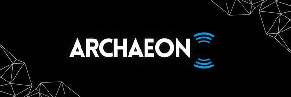

<div align="center">



# IRC over LoRa mesh network


</div>

## Description

Archaeon turns an ESP32 + LoRa board into a standalone IRC server. No internet, no cell network, no infrastructure needed.

Each node broadcasts its own Wi-Fi network. Connect with any IRC client, and your messages hop across the LoRa mesh to reach every other node.

## How it works

1. Connect your IRC client to a node's Wi-Fi and join a channel.
2. Your message gets encrypted and sent out over LoRa.
3. Nearby nodes pick it up, rebroadcast it, and pass it along until it reaches everyone.
4. Once a node has all the pieces, it decrypts the message and delivers it to connected clients.

Every node shares the same encryption key, so any node can relay any message. There's no central server, the mesh keeps working even if a node goes down.

## What you'll need

- An **ESP32** board with Wi-Fi
- An **SX1276/SX1278** LoRa radio (SPI)
- An **SSD1306** 128×64 OLED display

The default settings are tuned for the **LilyGO TTGO T3**, but it works on similar boards too

The OLED and status LED are just for local diagnostics, you can skip them for a headless build.

## Setup

### 1. Set your secrets

Open `LilyGO_T3.ino` and set these two values at the top:

```cpp
#define AP_PASSWORD    "change_me"   // Wi-Fi password (8+ characters)
#define MESH_PSK_HEX   "change_me"   // 32 hex characters, the mesh encryption key
```

Every node on your mesh needs the **same** `MESH_PSK_HEX`. Generate one with:
```
openssl rand -hex 16
```

Also set `LORA_BAND` to match your region: `915E6` (US), `868E6` (EU), `433E6` (Asia). This must match on every node too.

### 2. Flash it

Open the sketch in Arduino IDE or PlatformIO (with the ESP32 board package installed), pick your board, and upload.

**Libraries you'll need:**
- [`LoRa`](https://github.com/sandeepmistry/arduino-LoRa)
- [`Adafruit_GFX`](https://github.com/adafruit/Adafruit-GFX-Library)
- [`Adafruit_SSD1306`](https://github.com/adafruit/Adafruit_SSD1306)
- The ESP32 core libraries (bundled automatically)

### 3. Connect

Each node creates its own Wi-Fi network, named with an auto-generated ID. You'll see the network name and IRC address on the OLED:

```
AP: node_a1b2c3
192.168.4.1:6667
```

Connect an IRC client to that address, pick a nickname, and you're automatically in `#mesh`. Anything you send there, or as a direct message, travels across the mesh to other nodes.

## What the screen shows

- Node name and signal strength (RSSI)
- Messages sent / received
- Queue depth and how many clients are connected
- Messages still being reassembled, and current radio usage
- Wi-Fi and IRC connection info

## Security notes

- Messages are encrypted, but every node shares the same key, so any node can read any message. This protects against outside eavesdropping, not against a compromised node.
- Wi-Fi password and mesh key live in the firmware itself. If a device is lost or stolen, rotate the key on the rest of your mesh.
- There's no login system beyond picking a nickname, anyone who can reach a node's Wi-Fi can read and post in any channel.

## License

Distributed under the **MIT License**, see [`LICENSE`](LICENSE) for full terms.